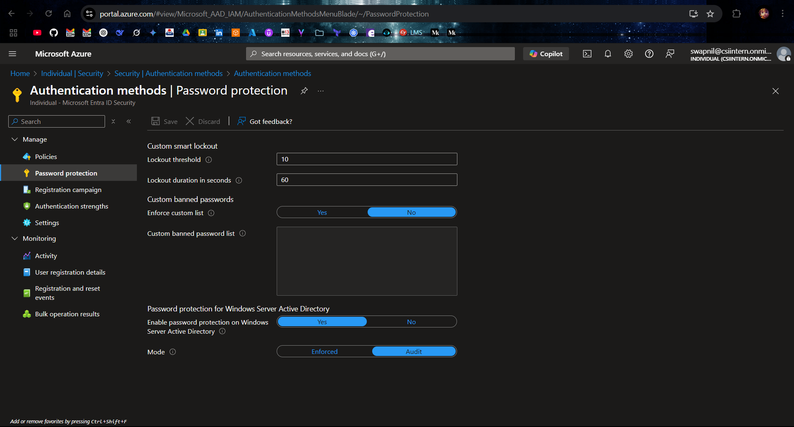

# 🔐 Custom Account Lockout (Smart Lockout) – Microsoft Entra ID

This setup enforces **Custom Account Lockout** to protect against brute-force sign-in attacks in Microsoft Entra ID. After a defined number of failed sign-in attempts, accounts are temporarily locked.

## 📋 Summary

- 🔁 Lockout after `1` failed login attempts  
- ⏱️ Lockout duration is `30` seconds  
- 🚫 Optional enforcement of custom banned passwords

## ✅ Configuration Steps

### 1️⃣ Sign in to the Entra Admin Center

- Go to [Azure Portal](https://portal.azure.com)

### 2️⃣ Navigate to Password Protection Settings

- From the left menu, go to:  
  `Microsoft Entra ID > Protection > Authentication methods > Password protection`

### 3️⃣ Configure Account Lockout Settings

In the **Password protection** page:

| ⚙️ Setting | 🔢 Value | 📝 Description |
|-----------|----------|----------------|
| **Lockout threshold** | `1` | Max failed sign-in attempts before lockout |
| **Lockout duration (seconds)** | `30` | Lockout duration before login is allowed again |

- Click **💾 Save**

## 🧪 How to Test the Configuration

To verify that the account lockout is working:

### 🧾 Step-by-step:

1. 👤 Use a **test user account**
2. 🔗 Go to [Azure Portal](https://portal.azure.com)
3. 🧑‍💻 Enter username
4. ❌ Repeatedly enter the **wrong password**
5. 🚫 You should see a temporary lockout
6. ⌛ Wait `30` seconds, then try again

> ✅ You can view logs in:  
> `Microsoft Entra ID > Monitoring > Sign-in logs`  
> 🔍 Filter by failure reasons or lockouts

