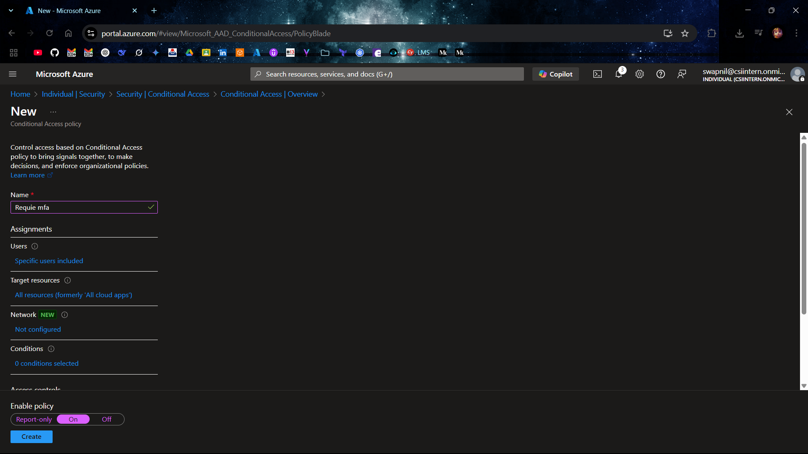
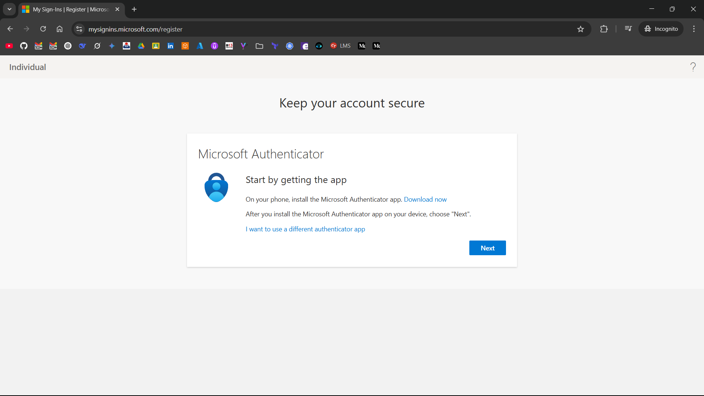
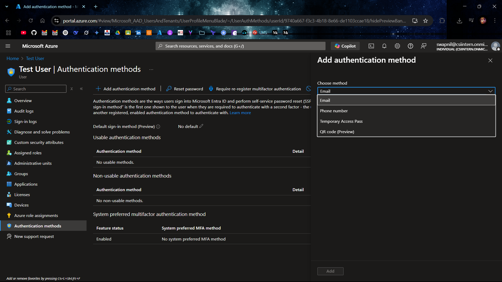

# 🔐 Microsoft Entra ID Multi-Factor Authentication (MFA) Setup and Management

Steps to configure, manage, and monitor Microsoft Entra ID Multi-Factor Authentication (MFA), including Two-Factor Authentication (2FA) methods, using the Microsoft Entra ID.

## 1. 👤 Manage User MFA Settings

1. Sign in to the [Azure Portal](https://portal.azure.com)
2. Navigate to:  
   `Microsoft Entra ID > Users`
3. Click **Per-user MFA** from the toolbar
4. On the **Multi-Factor Authentication** page:
   - Select the user(s)
   - Click **Enable** in the right pane
5. ✅ Confirm activation

## 2. ⚙️ Configure MFA

1. **Access Security Settings**:
   - Go to **Microsoft Entra ID** > **Security** in the Azure Portal.
2. **Enable MFA via Conditional Access**:
   - Go to **Security** > **Conditional Access** > **New policy**.
   - Set **Name**: e.g., "Require MFA".
   - Assign to users/groups, select apps, set **Grant** to **Require multifactor authentication**.
   - Enable policy: **On** ✅

## 3. 📊 Monitor MFA Activity

1. **Check Sign-in Logs**:
   - Go to **Microsoft Entra ID** > **Sign-ins**.
   - Filter by **Authentication requirement**: "Multifactor authentication".
   - Review user, method, and status 🔍

## 4. 🔐 Configure Two-Factor Authentication (2FA) Methods

1. **Enable Microsoft Authenticator**:
   - Go to **Security** > **Authentication methods**.
   - Enable **Microsoft Authenticator**, select users/groups.
2. **Enable SMS**:
   - Go to **Security** > **Authentication methods**.
   - Enable **SMS**, select users/groups.
   - Add user phone number via **Users** > **select user** > **Authentication methods**.

**Configure any other method you want.** ✅

