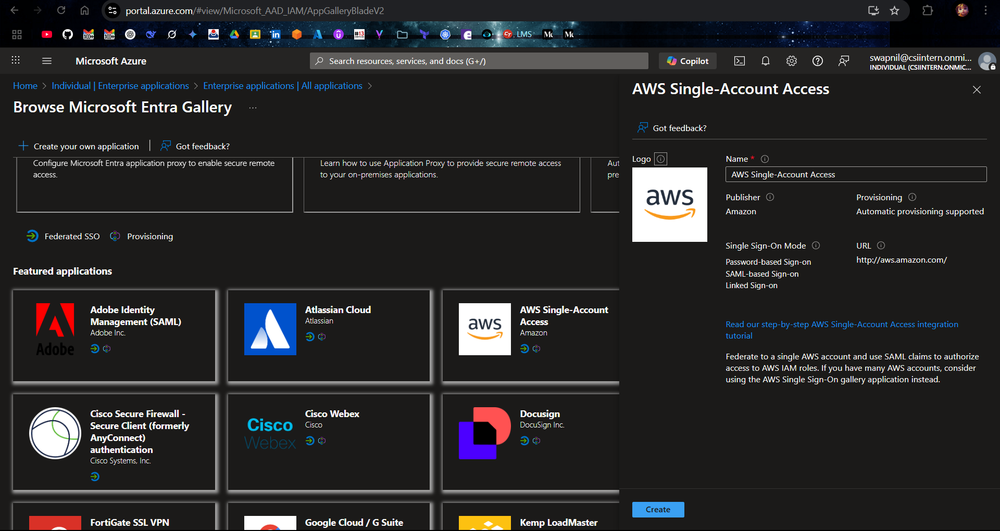
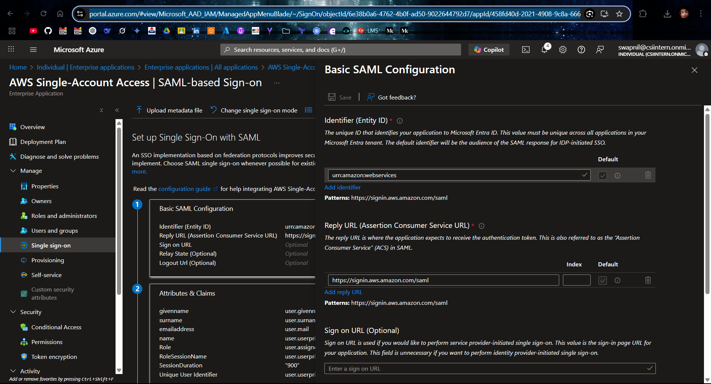
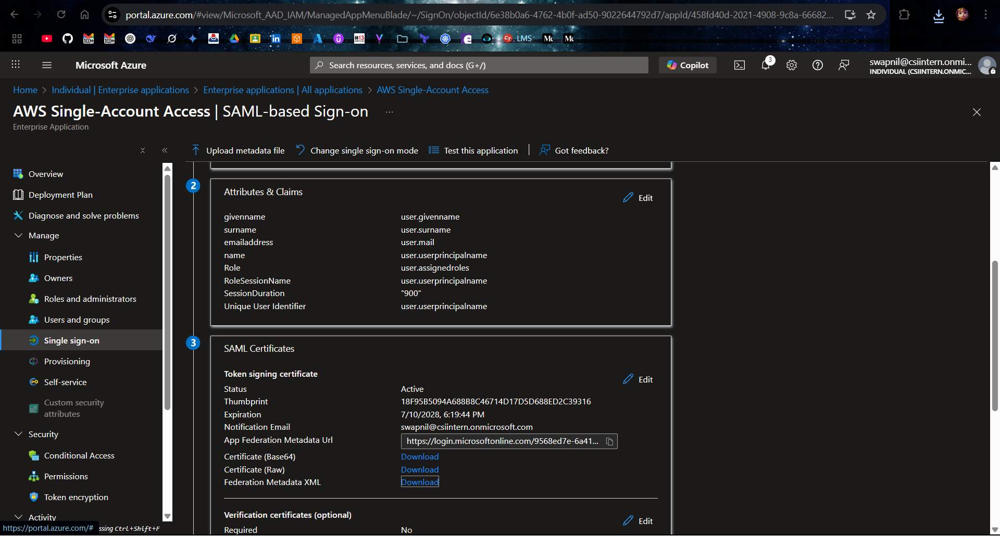
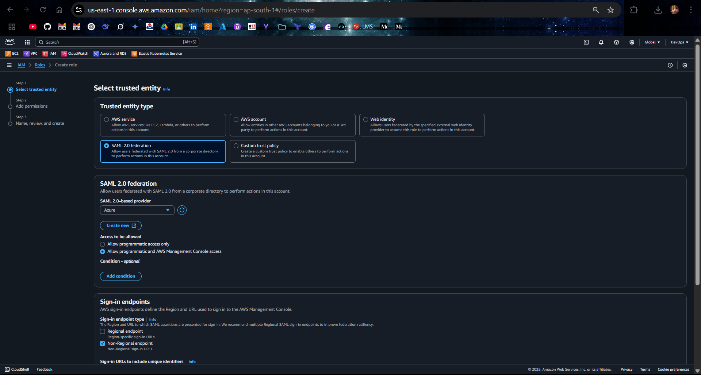
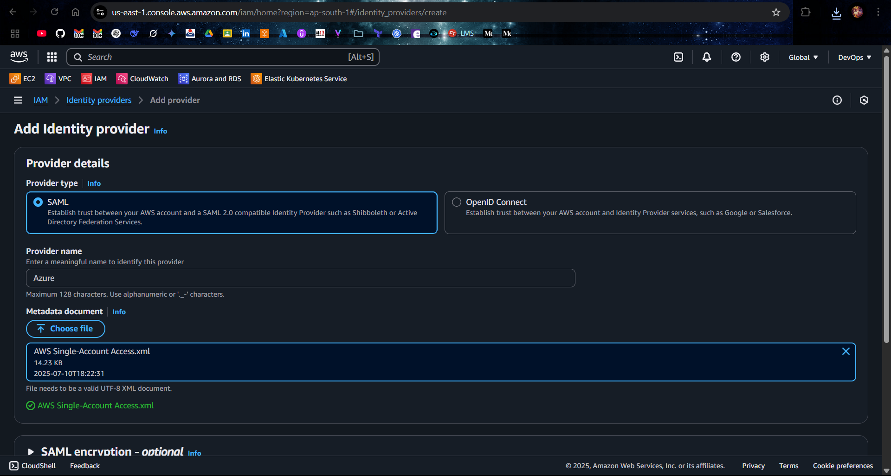
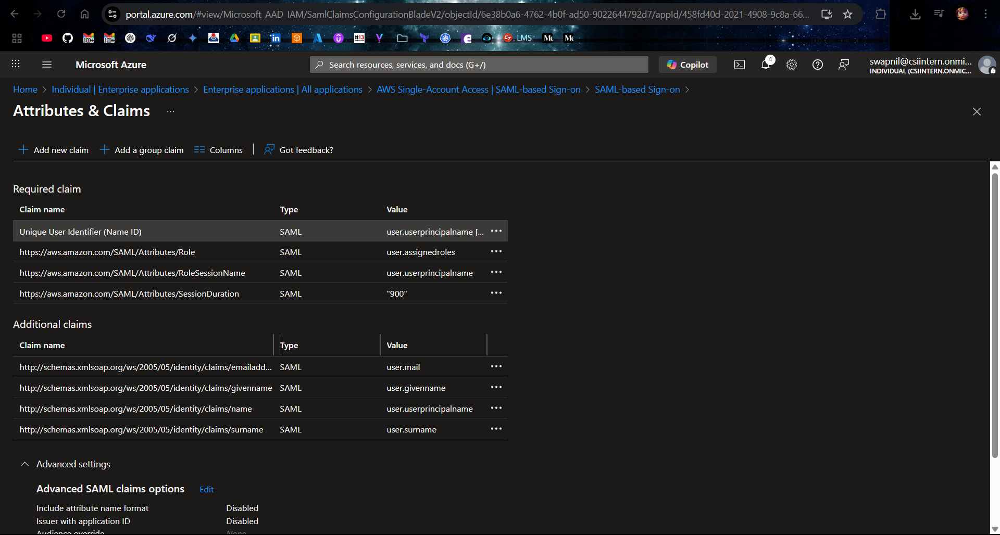
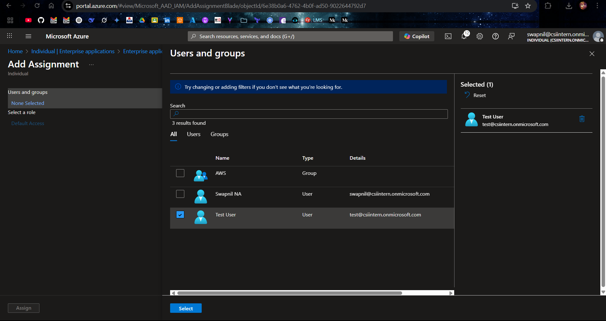
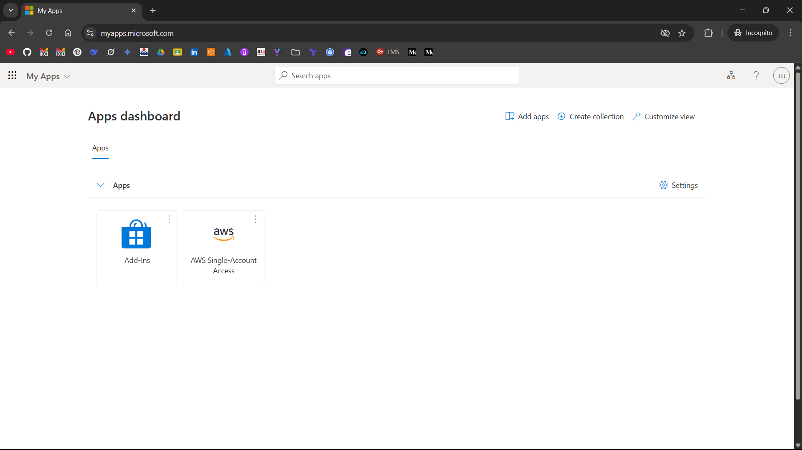
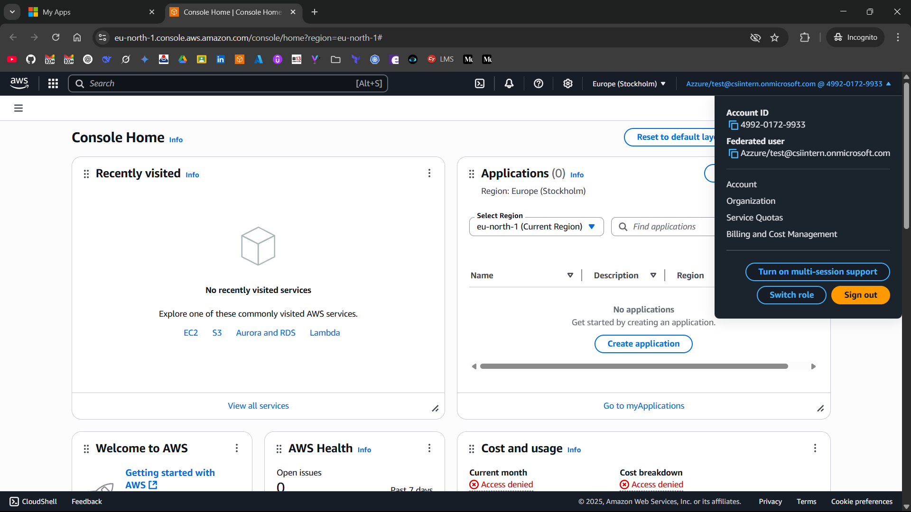

# 🔐 Azure AD (Microsoft Entra ID) Extend MFA to Third-Party

This configuration demonstrates extension of Microsoft Entra ID MFA to third-party applications such as AWS, using SAML 2.0 federation. Users are authenticated via Azure AD where MFA is enforced, and are then securely signed into AWS without needing separate credentials or MFA configuration in AWS itself.

---

## 🔧 Step-by-Step Configuration

###  1. Create Enterprise Application in Azure AD

1. Go to `Microsoft Entra ID → Enterprise Applications → + New application`
2. Select: **Amazon Web Services (AWS)** from the gallery
3. Name it: `AWS Single Account Access`



4. Go to `Single Sign-on → SAML`
5. Under **Basic SAML Configuration**, enter:
   - **Identifier (Entity ID)**: `urn:amazon:webservices`
   - **Reply URL**: `https://signin.aws.amazon.com/saml`



---

###  2. Download SAML Metadata and Upload to AWS

1. Go to the **SAML Single Sign-on** configuration page in Azure
2. Download the **Federation Metadata XML**



---

###  3. Create AWS IAM Role for SAML Access

1. Go to **AWS Console** → `IAM → Roles → Create Role`
2. Choose **SAML 2.0 federation**
3. Select your **SAML provider** (will be created in the next step)
4. Assign any **policy** (e.g., `AdministratorAccess` for testing)
5. Set **Role Name**: `AzureAD-SSO`
6. Modify the **trust policy** to allow Azure SSO:

```json
{
  "Version": "2012-10-17",
  "Statement": [
    {
      "Effect": "Allow",
      "Principal": {
        "Federated": "arn:aws:iam::<ACC_ID>:saml-provider/Azure"
      },
      "Action": "sts:AssumeRoleWithSAML",
      "Condition": {
        "StringEquals": {
          "SAML:aud": "https://signin.aws.amazon.com/saml"
        }
      }
    }
  ]
}
```



---

###  4. Create SAML Identity Provider in AWS

1. Go to `IAM → Identity Providers → Add Provider`
2. Choose:
   - **Provider Type**: SAML
   - **Provider Name**: `Azure`
   - **Metadata Document**: Download from Azure
3. Save



---

###  5. Configure Required Claims

Go to `User Attributes & Claims` → click **Edit** and:

#### 📌 Add new claim:

| Claim Name                                               | Value                                                                                           |
| -------------------------------------------------------- | ----------------------------------------------------------------------------------------------- |
| `https://aws.amazon.com/SAML/Attributes/Role`            | `arn:aws:iam::<ACC_ID>:role/AzureAD-SSO-Demo,arn:aws:iam::<ACC_ID>:saml-provider/Azure` |
| `https://aws.amazon.com/SAML/Attributes/RoleSessionName` | `user.userprincipalname`                                                                        |
| `https://aws.amazon.com/SAML/Attributes/SessionDuration` | `900`                                                                                           |
| `Unique User Identifier (Name ID)`                       | `user.userprincipalname` (email format)                                                         |

✅ Remove any `user.assignedroles` claim if present to avoid conflict.



---

###  6. Assign the User to the AWS Application

1. Go to: `Enterprise Applications → AWS → Users and Groups`
2. Click **+ Add user/group**
3. Select the user: `test@csiintern.onmicrosoft.com`
4. Click **Assign**



---

## 🦖 Testing SSO Login

1. Go to [https://myapps.microsoft.com](https://myapps.microsoft.com)
2. Sign in as `test@csiintern.onmicrosoft.com`
3. Click the **AWS app tile**



4. You’ll be redirected to AWS Console with the assigned IAM role


