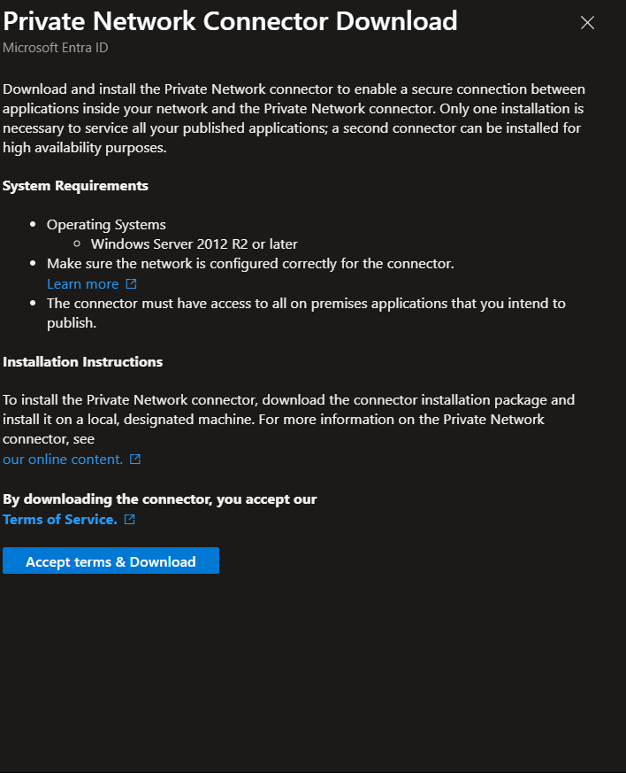
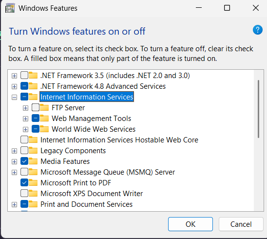
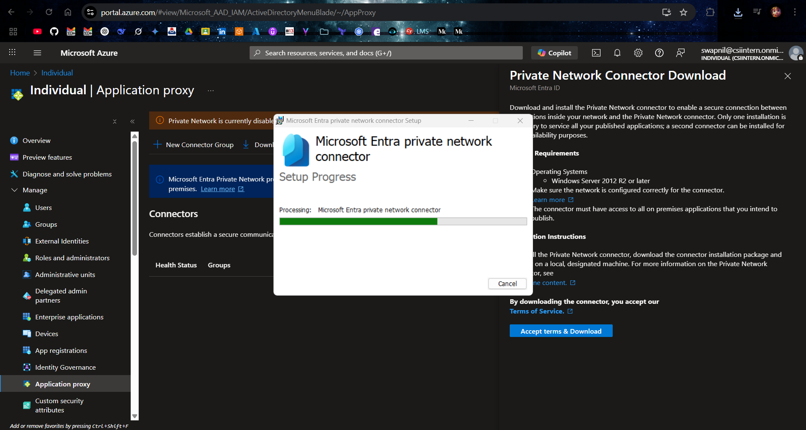
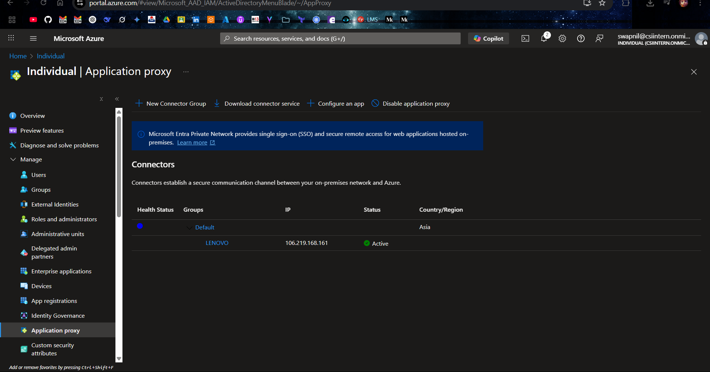
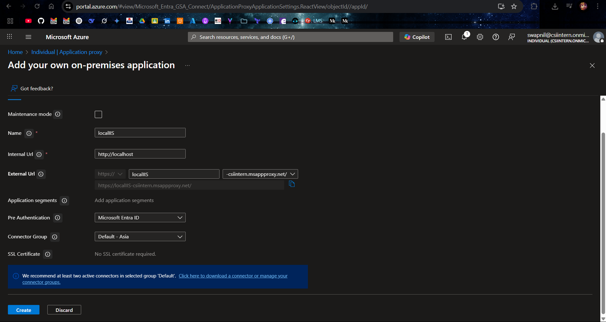
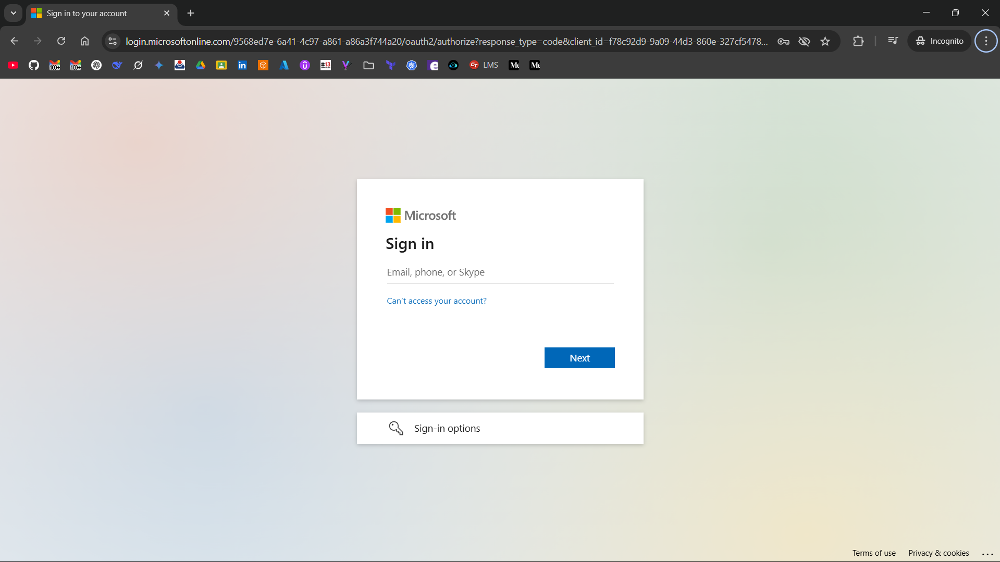
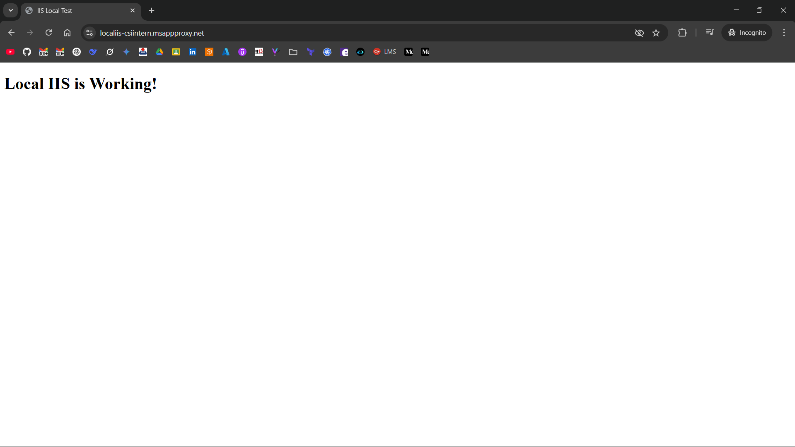

# 🔐 Extend Azure AD MFA to On-Premises

This project demonstrates how to extend **Microsoft Entra ID (Azure AD) Multi-Factor Authentication (MFA)** to an **on-premises web application** hosted on a local IIS server using **Azure AD Application Proxy**.

## 📌 Overview

- 🖥️ Host a local IIS web app
- 🔌 Install Azure AD Application Proxy Connector
- 🌐 Publish internal app to the internet via Azure AD
- 👥 Enforce Azure AD authentication & MFA

## ✅ Steps

### 1. Enable Azure AD Application Proxy

1. Go to [Azure Portal](https://portal.azure.com)
2. Navigate to:  
   `Microsoft Entra ID → Applications → Application proxy`
3. Download the **Application Proxy Connector**

### 2. Install IIS on Local Machine

1. Press `Win + R` → type `optionalfeatures`
2. Enable:
   - ✅ Internet Information Services
   - ✅ Web Management Tools
   - ✅ World Wide Web Services
3. Save and restart (if needed)
4. Test: Open a browser → `http://localhost`
(Optional: add `index.html` to `C:\inetpub\wwwroot`)

### 3. Install Application Proxy Connector

1. Run the downloaded connector `.exe` file
2. Sign in with your Azure AD **Global Admin**
3. Wait until setup completes

4. Go to:  
   `Microsoft Entra ID → Application proxy → Connectors`
   - Ensure your device shows **Active** and **Healthy**

### 4. Publish Local IIS App via App Proxy

1. In **Application proxy**, click: **+ Configure an app**
2. Fill in details:

| Field | Value |
|-------|-------|
| **Name** | `Local IIS` |
| **Internal URL** | `http://localhost` |
| **External URL** | (Auto-generated) |
| **Pre-authentication** | **Microsoft Entra ID** |
| **Connector Group** | Default-Asia |

3. Click **Add**

### 5. Test External Access with Azure AD MFA

1. Copy the **External URL** from the app page
2. Open in an incognito/private browser
3. Sign in using a test Azure AD user
4. Complete **MFA authentication** if required
5. You should see the **IIS page served from localhost**

