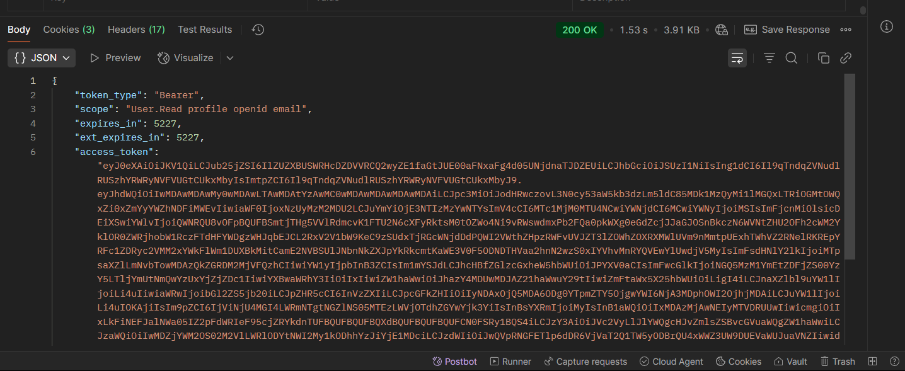

# 🔐 OAuth Authorization Code Flow in Microsoft Entra ID

This README provides steps to set up an OAuth authorization code flow in Microsoft Entra ID, using `jwt.ms` as the redirect URL, generating a client secret, obtaining an authorization code, exchanging it for an access token in Postman, and validating the token with `jwt.ms`.

## 📝 Steps

### 1. Create App Registration

1. Sign in to the [Azure Portal](https://portal.azure.com).
2. Navigate to **Microsoft Entra ID** > **App registrations**.
3. Click **New registration**.
4. Enter a name
5. Set **Redirect URI** to `https://jwt.ms` (select **Web**).
6. Click **Register**.


7. Note the **Application (client) ID**: `11d7a34f-b5ca-4d4d-bed1-f40909f3c783`.
8. Note the **Directory (tenant) ID**: `90953422-e0d1-4b8c-9d1f-1ff2afa41b1a`.


### 2. Generate Client Secret

1. In the app registration, go to **Certificates & secrets** > **Client secrets**.
2. Click **New client secret**, add a description, and select an expiry.
3. Click **Add** and copy the **secret value**.


### 3. Obtain Authorization Code

1. Open a browser and navigate to:
   ```
   https://login.microsoftonline.com/<TENANT_ID>/oauth2/v2.0/authorize?client_id=<CLIENT_ID>&response_type=code&redirect_uri=https%3A%2F%2Fjwt.ms&response_mode=query&scope=User.Read&state=12345&prompt=login
   ```
2. Sign in with a Microsoft account and grant permissions.


3. After authentication, you will be redirected to a URL starting with `https://jwt.ms?code=`.
4. Copy the **code** parameter from the URL.


### 4. Create Postman POST Request

1. Open Postman and create a new request.
2. Set the request type to **POST** and the URL to:
   ```
   https://login.microsoftonline.com/<TENANT_ID>/oauth2/v2.0/token
   ```
3. Go to the **Body** tab and select **x-www-form-urlencoded**.
4. Add the following key-value pairs:
   - `grant_type`: `authorization_code`
   - `client_id`: `11d7a34f-b5ca-4d4d-bed1-f40909f3c783`
   - `client_secret`: [Your client secret from step 2]
   - `code`: [Code from step 3]
   - `redirect_uri`: `https://jwt.ms`
   - `scope`: `User.Read`


5. Click **Send** to retrieve the access token.
6. Copy the **access_token** from the response.



### 5. Validate Token with jwt.ms

1. Open a browser and go to [jwt.ms](https://jwt.ms).
2. Paste the **access_token** into the input field.
3. Review the decoded JWT, including the header, payload , and signature.


