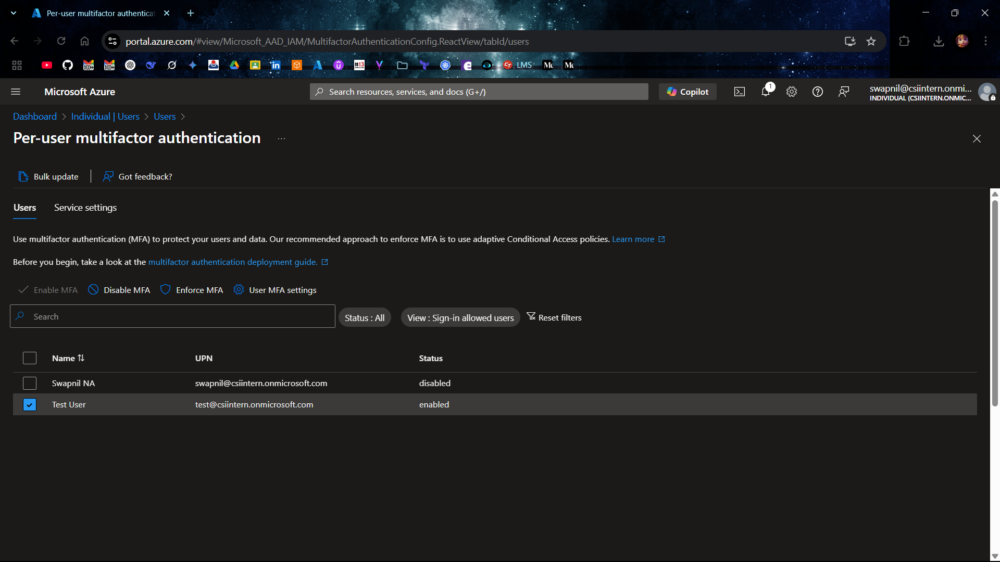
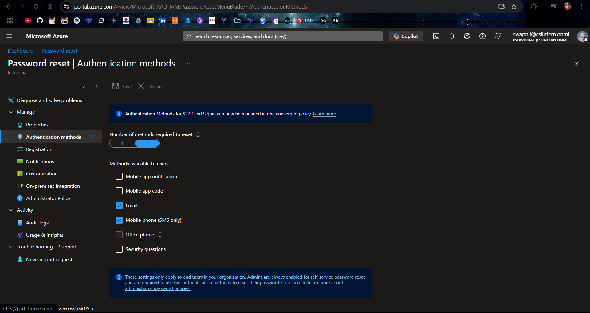
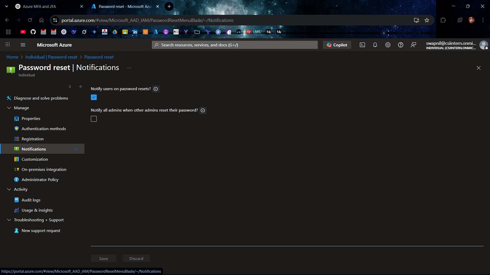
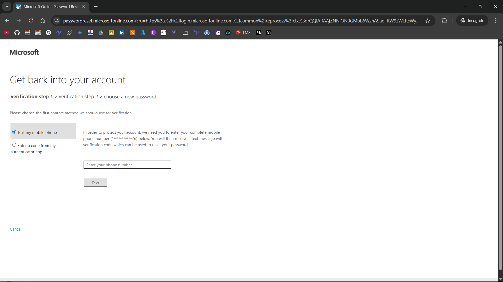

# 💻 Azure AD Self-Service Password Reset (SSPR) Setup

This guide walks through the process of configuring **Multi-Factor Authentication (MFA)** and deploying **Self-Service Password Reset (SSPR)** in the Microsoft Entra ID portal.

## 🔐 Step 1: Configure Multi-Factor Authentication (MFA)

SSPR requires at least one method of identity verification. MFA enhances security and is required for SSPR when two authentication methods are selected.

### ✅ Enable MFA for Users

1. Sign in to the [Azure Portal](https://portal.azure.com)
2. Navigate to:  
   `Azure Active Directory > Users`
3. Click **Per-user MFA** from the toolbar
4. On the **Multi-Factor Authentication** page:
   - Select the user
   - Click **Enable** in the right pane
5. ✅ Confirm activation

## 🔧 Step 2: Configure and Deploy Self-Service Password Reset (SSPR)

### 1️⃣ Enable SSPR

1. In the Azure Portal, go to:  
   `Microsoft Entra ID > Password reset > Properties`
2. Under **Self-service password reset enabled**, select:
   - `None` — ❌ Disable SSPR
   - `Selected` — ☑️ Enable for a specific group
   - `All` — ✅ Enable for all users
3. Click **Save**

### 2️⃣ Configure Authentication Methods for SSPR

1. Go to:  
   `Azure Active Directory > Password reset > Authentication methods`
2. Choose:
   - 🔢 **Number of methods required**: 1 or 2
   - 🔐 **Available methods**:
     - 📱 Mobile phone
     - 📧 Email
     - ❓ Security questions
     - 🔑 Microsoft Authenticator app
3. Click **Save**

### 3️⃣ Set Notification Preferences (Optional)

1. Navigate to:  
   `Azure Active Directory > Password reset > Notifications`
2. Enable:
   - 🔔 Notify users on password resets
   - ⚠️ Notify admins when privileged accounts reset their passwords
3. Click **Save**

### 4️⃣ Test and Deploy SSPR

1. Use a test user to validate the reset flow.
2. Attempt "Forgot my password?" and follow the reset process 🔄

### 📊 Monitor SSPR events via:  
   `Azure Active Directory > Password reset > Audit logs`

